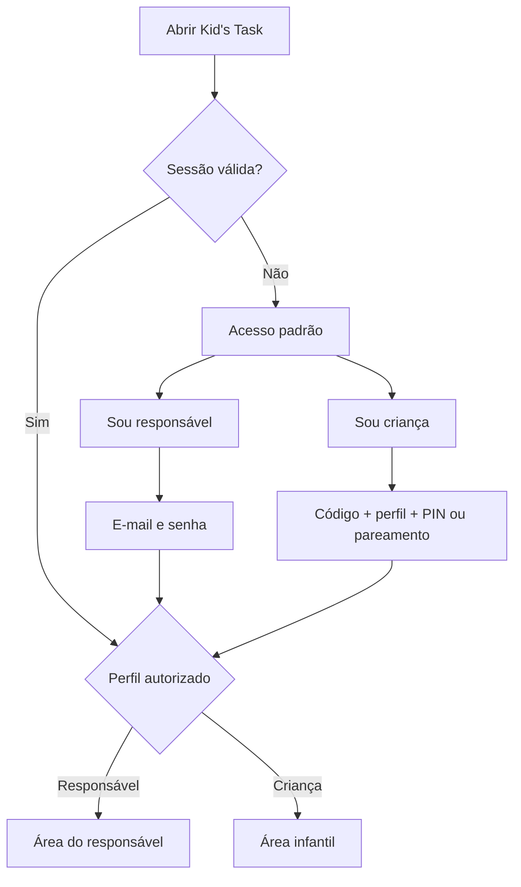

# 03 — Usuários, Família e Autenticação

## 1. Perfis

| Perfil | Identificador técnico | Pode administrar tarefas | Pode concluir tarefas | Pode operar a plataforma |
|---|---|---:|---:|---:|
| Responsável proprietário | `family_owner` | Sim | Em nome da criança, com auditoria | Não |
| Responsável convidado | `family_guardian` | Sim | Em nome da criança, com auditoria | Não |
| Criança | `child` | Não | Sim | Não |
| Administrador da plataforma | `platform_admin` | Não por padrão | Não | Conforme função |

O papel não pode ser escolhido nem alterado pelo cliente após o login. A autorização consulta relações persistidas e protegidas no backend.

## 2. Um único aplicativo, duas experiências

Não deve existir parâmetro de rota, botão oculto ou flag local capaz de transformar uma sessão infantil em responsável.

## 3. Cadastro do primeiro responsável

1. Criar conta por e-mail e senha.
2. Confirmar e-mail.
3. Exibir termos, política de privacidade e consentimento específico para dados infantis.
4. Criar família e selecionar fuso horário.
5. Criar o primeiro perfil infantil.
6. Escolher tema.
7. Configurar PIN ou modo sem PIN.
8. Criar até três tarefas iniciais no plano gratuito.
9. Solicitar permissão de notificações no momento contextual adequado.

Login social pode ser adicionado posteriormente, desde que mantenha as mesmas regras de consentimento e vínculo familiar.

## 4. Múltiplos responsáveis

### Convite

1. Responsável autenticado informa o e-mail do convidado.
2. Backend cria convite de uso único, com validade recomendada de 72 horas.
3. E-mail contém um universal link/app link.
4. Se o aplicativo estiver instalado, o link abre a tela de aceite.
5. Se não estiver, abre uma página segura com links das lojas e instruções.
6. O convidado entra ou cria sua conta.
7. Backend valida token, e-mail, validade e estado antes de criar `family_membership`.

### Regras

- Token é armazenado apenas em forma de hash.
- Aceite é idempotente.
- Convite pode ser cancelado.
- Reenvio invalida token anterior.
- Responsável convidado não acessa outra família sem vínculo explícito.
- Remover um responsável exige reautenticação e auditoria.

## 5. Código da família

- Gerado no servidor com entropia suficiente e caracteres não ambíguos.
- Formato de apresentação recomendado: oito caracteres, por exemplo `KT7F-9Q2M`.
- Não usar sequência previsível, ID do banco, telefone ou nome da criança.
- Normalizar maiúsculas e ignorar hífen/espaço na entrada.
- Armazenar digest seguro para consulta, não texto simples.
- Exibir ao responsável na criação; se for perdido, gerar novo código.
- Regenerar o código revoga o anterior.
- Aplicar limite de tentativas por IP, aparelho e conta anônima.

## 6. Acesso da criança

### Criança com PIN

1. O aplicativo cria ou restaura uma identidade técnica limitada do aparelho.
2. A criança digita o código da família.
3. Após validação, escolhe seu avatar/apelido em uma lista mínima.
4. Digita o PIN.
5. Backend valida o PIN e vincula aquela identidade técnica ao perfil infantil.
6. O aplicativo recebe somente os dados autorizados da criança selecionada.

Recomendação: PIN numérico de 4 a 6 dígitos. O responsável define e pode redefinir. Não guardar PIN em texto puro.

### Criança sem PIN

Código familiar sozinho não é suficiente. Um responsável deve autorizar o aparelho:

- pelo próprio aplicativo, entrando temporariamente no modo responsável e concluindo uma barreira parental; ou
- por um código de pareamento curto e temporário gerado no painel do responsável.

Depois do pareamento, o aparelho entra diretamente no perfil infantil até ser revogado ou desconectado.

### Proteções

- respostas de erro genéricas para não revelar se família, perfil ou PIN existem;
- atraso progressivo após erros;
- bloqueio temporário configurável;
- registro de tentativas suspeitas;
- opção de revogar todos os aparelhos da criança;
- nome do aparelho e última atividade visíveis ao responsável;
- sessão infantil não acessa e-mail, assinatura ou dados de outros filhos.

## 7. Identidade técnica recomendada para a criança

O MVP pode usar autenticação anônima do Supabase por aparelho e uma tabela de vínculo `child_device_bindings`.

- `auth.uid()` identifica a sessão técnica.
- Uma Edge Function autoriza o vínculo após PIN ou pareamento.
- Políticas RLS verificam se o vínculo está ativo e apontam para a criança correta.
- Revogar o vínculo remove o acesso imediatamente.
- A criança não recebe `service_role`, credencial interna nem token de outro usuário.

Essa estratégia preserva o uso de RLS sem exigir e-mail infantil fictício.

## 8. Troca de perfil e saída

- O responsável pode sair da conta normalmente.
- A saída infantil deve ficar atrás de barreira parental, principalmente para 2–7 anos.
- Um aparelho pode memorizar apenas o último perfil infantil autorizado.
- Para alternar entre crianças, exigir PIN correspondente ou autorização adulta.
- Nunca mostrar painel de seleção com dados de outra família.

## 9. Recuperação

- Senha do responsável: fluxo seguro do Supabase por e-mail.
- PIN infantil: somente responsável autenticado pode redefinir.
- Código familiar: não recuperar o código antigo; regenerar.
- Aparelho perdido: responsável revoga a vinculação e o token de push.

## 10. Exclusão da família

O fluxo detalhado está em `10_SEGURANCA_PRIVACIDADE_E_LGPD.md`.

Regra resumida:

- com dois ou mais responsáveis ativos, outro responsável precisa aprovar;
- se houver recusa, a solicitação é encerrada sem exclusão;
- com apenas um responsável, exigir reautenticação e confirmação reforçada;
- a operação final deve revogar sessões, remover ou anonimizar dados e gerar comprovante.

