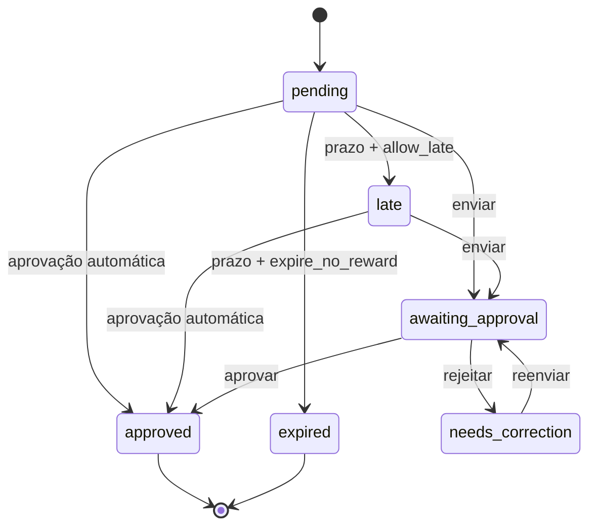

# 04 — Tarefas, Aprovações e Rotina

## 1. Conceitos

- **Tarefa:** definição reutilizável, como “Escovar os dentes”.
- **Agenda:** regra que diz quando a tarefa ocorre.
- **Ocorrência:** item concreto exibido em uma data.
- **Conclusão:** ação da criança ou do responsável sobre uma ocorrência.
- **Aprovação:** validação necessária antes de conceder recompensa, quando configurada.

Histórico deve apontar para a ocorrência, nunca apenas para a tarefa atual.

## 2. Tipos aceitos

| Tipo | Exemplo |
|---|---|
| Recorrente | Toda segunda a sexta às 08:00 |
| Data específica | Organizar mochila em 03/08 |
| Bônus | Ajudar a lavar o carro no sábado |
| Sem horário | Ler durante o dia |
| Com prazo final | Finalizar até 19:00 |

Uma tarefa bônus é opcional e não prejudica streak quando não concluída.

## 3. Campos de uma tarefa

- criança;
- título;
- descrição opcional;
- ícone do catálogo;
- categoria;
- período: `morning`, `afternoon_evening` ou `anytime`;
- horário inicial opcional;
- prazo opcional;
- agenda única ou recorrente;
- dias da semana;
- data inicial e final opcionais;
- obrigatória ou bônus;
- KidsCoins concedidos;
- XP concedido pelo sistema;
- aprovação automática ou manual;
- política após o prazo;
- ordem de exibição;
- ativa/pausada;
- criador e timestamps.

O valor de KidsCoins deve ser inteiro e não negativo. A interface pode sugerir valores, mas o responsável decide.

## 4. Períodos

O MVP terá:

- **Manhã**
- **Tarde/Noite**
- **Qualquer horário**

O aplicativo infantil prioriza o período atual, mas permite consultar o restante do dia. Os horários-limite são definidos na família e podem ser sobrescritos pela tarefa.

## 5. Política após o prazo

O responsável escolhe uma das duas políticas em cada tarefa:

| Política | Comportamento |
|---|---|
| `allow_late` | Fica atrasada, continua disponível e mantém a recompensa configurada |
| `expire_no_reward` | Expira, não pode ser concluída pela criança e não concede KidsCoins/XP |

Uma ocorrência enviada antes do prazo e aguardando aprovação continua elegível, mesmo que o responsável aprove depois.

## 6. Aprovação

### Automática

Ao tocar em “Concluir”:

1. backend valida sessão, ocorrência e prazo;
2. marca a ocorrência como aprovada;
3. credita KidsCoins e XP na mesma transação;
4. recalcula nível e progresso diário;
5. cria eventos e notificações;
6. retorna o novo saldo.

### Manual

Ao tocar em “Concluir”:

1. ocorrência vira `awaiting_approval`;
2. responsável recebe notificação;
3. responsável aprova ou rejeita;
4. aprovação concede recompensa uma única vez;
5. rejeição exige motivo curto e move para `needs_correction`;
6. criança pode corrigir e reenviar enquanto a política permitir.

## 7. Máquina de estados

Estados auxiliares:

- `cancelled`: ocorrência removida antes da conclusão;
- `skipped_by_guardian`: responsável justifica a dispensa; não prejudica streak;
- `paused`: tarefa-base temporariamente desativada, sem gerar novas ocorrências.

## 8. Recompensa exatamente uma vez

- Cada aprovação possui chave de idempotência.
- O ledger tem restrição única por origem e tipo.
- Repetir requisição, atualizar tela ou receber callback duplicado não cria novo crédito.
- Alteração posterior do valor da tarefa não muda ocorrências já geradas.
- A ocorrência armazena snapshots de KidsCoins, XP, aprovação e política de prazo.

## 9. Geração de ocorrências

- Job diário gera uma janela móvel, recomendada de 30 dias.
- Criação/edição de agenda atualiza ocorrências futuras ainda não iniciadas.
- Restrição única evita duplicação.
- Datas usam fuso da família.
- Alteração de fuso exige recalcular somente ocorrências futuras.
- Ocorrências concluídas, enviadas ou expiradas são históricas e imutáveis, salvo ação administrativa auditada.

## 10. Plano gratuito

Antes de ativar uma agenda ou tarefa pontual, o backend verifica se algum dia ultrapassará três ocorrências.

Se ultrapassar:

- não ativar silenciosamente;
- mostrar as ocorrências em conflito;
- permitir pausar ou substituir uma tarefa;
- oferecer Premium na área do responsável;
- nunca abrir paywall no ambiente infantil.

## 11. Edição e exclusão

- Editar uma tarefa afeta ocorrências futuras pendentes.
- Excluir deve preferir arquivamento lógico da tarefa-base.
- Histórico conserva título, ícone e recompensa em snapshot.
- Pausar impede novas ocorrências sem apagar agenda.
- Reordenar usa valor estável de ordenação e deve sincronizar entre aparelhos.

## 12. Ações do responsável

O responsável pode:

- criar, duplicar, editar, pausar e arquivar;
- concluir em nome da criança, com auditoria;
- aprovar, rejeitar e informar motivo;
- dispensar uma ocorrência sem afetar o streak;
- filtrar por criança, período, estado e data;
- usar tarefas prontas do catálogo;
- acompanhar o progresso do dia em tempo real.

## 13. Tarefas de fim de semana

Sábado e domingo não recebem obrigatoriedade automática. O responsável pode:

- criar bônus opcionais;
- criar tarefa obrigatória conscientemente;
- definir recompensa maior;
- escolher se aquela tarefa obrigatória participa do streak.

## 14. Sem punição automática

Uma tarefa perdida:

- não retira KidsCoins;
- não retira XP;
- pode interromper streak conforme a regra escolhida;
- aparece nos relatórios como não concluída ou expirada.

