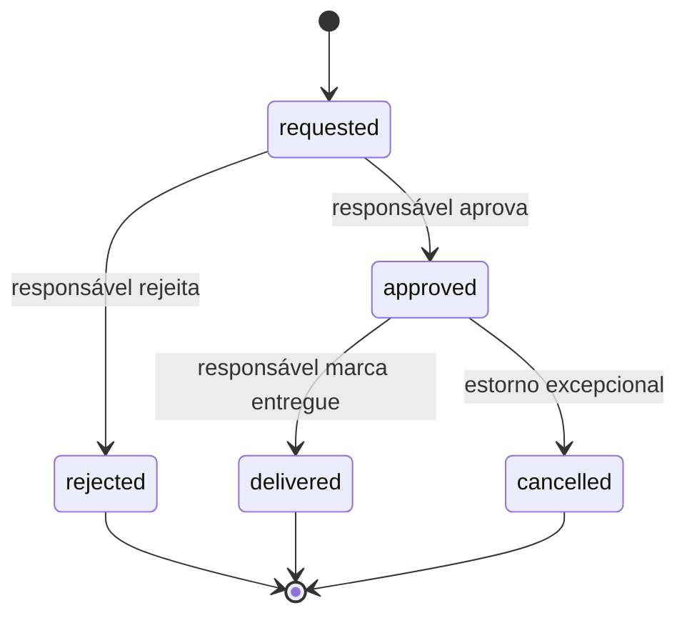

# 05 — KidsCoins, Recompensas, XP e Streak

## 1. Separação das economias

| Recurso | Finalidade | Pode ser gasto? |
|---|---|---:|
| KidsCoin | Solicitar recompensas familiares | Sim |
| XP | Evoluir de nível e liberar cosméticos | Não |

Os dois podem ser concedidos na mesma aprovação, mas devem ter ledgers e regras distintas.

## 2. Carteira de KidsCoins

- Saldo nunca pode ficar negativo.
- Toda alteração cria lançamento imutável.
- Não permitir edição ou exclusão direta de lançamento.
- Correção é feita por lançamento compensatório.
- A tela mostra saldo, origem, quantidade, data e motivo em linguagem simples.
- A criança vê seus próprios lançamentos.
- Responsáveis veem os lançamentos das crianças de sua família.

### Tipos de lançamento

- tarefa aprovada;
- bônus de nível;
- bônus de aniversário;
- ajuste positivo do responsável;
- ajuste negativo do responsável;
- resgate aprovado;
- estorno de resgate;
- correção administrativa auditada.

## 3. Ajuste manual

O responsável pode adicionar ou retirar KidsCoins:

- motivo obrigatório;
- confirmação antes de retirar;
- valor inteiro positivo informado na ação;
- backend transforma a ação em crédito ou débito;
- débito maior que o saldo é rejeitado;
- criança recebe notificação com texto apropriado;
- ação fica associada ao responsável que a realizou.

## 4. Recompensas

O responsável pode cadastrar recompensas livres:

- título;
- descrição;
- imagem/ícone opcional;
- custo em KidsCoins;
- categoria, como dinheiro simbólico, passeio, tempo de tela ou presente;
- ativa/inativa;
- instrução opcional.

Não haverá limite de estoque ou quantidade de resgates no MVP. Uma recompensa inativa permanece no histórico.

## 5. Fluxo de resgate



Regras:

- toda solicitação exige aprovação;
- validar saldo na solicitação e novamente na aprovação;
- KidsCoins só são descontados na aprovação;
- requisições pendentes não alteram o saldo;
- aprovação sem saldo suficiente falha de forma clara;
- o responsável pode rejeitar com motivo;
- cancelamento após aprovação exige estorno atômico e auditoria;
- “entregue” registra a entrega física, mas não movimenta saldo novamente.

## 6. Conversão simbólica em dinheiro

O responsável pode configurar por criança uma taxa informativa, por exemplo:

> 10 KidsCoins = R$ 1,00

Essa conversão:

- serve para exibir recompensas familiares;
- usa centavos inteiros e moeda BRL;
- não transfere dinheiro;
- não cria carteira financeira;
- não permite saque;
- não transforma KidsCoin em ativo negociável.

## 7. XP por tarefa

Baseline do MVP:

- cada tarefa aprovada concede 10 XP;
- o valor padrão é uma configuração da plataforma, não texto fixo na UI;
- ocorrências guardam snapshot do XP;
- tarefa expirada não concede XP;
- tarefa rejeitada concede apenas após futura aprovação.

O responsável configura KidsCoins, mas não altera livremente XP, evitando distorção acidental da progressão.

## 8. Níveis

Os níveis são definidos em tabela, permitindo balanceamento sem nova versão do app. Seed sugerido:

```text
XP total para o nível L = 50 × (L - 1) × L
```

Exemplos:

| Nível | XP total mínimo |
|---:|---:|
| 1 | 0 |
| 2 | 100 |
| 3 | 300 |
| 4 | 600 |
| 5 | 1.000 |
| 10 | 4.500 |

O cliente consulta os limites publicados; não recalcula uma fórmula própria.

## 9. Bônus de nível

- Padrão inicial: 5 KidsCoins por nível alcançado.
- Responsável pode configurar o valor, inclusive zero.
- Se uma operação atravessar vários níveis, conceder o bônus de cada nível.
- Cada bônus tem origem única `level_up:<child_id>:<level>`.
- Reprocessamento não pode duplicar crédito.

## 10. Desbloqueios

Conteúdos desbloqueáveis:

- avatares;
- molduras;
- acessórios;
- animações;
- partes de temas;
- medalhas.

Cada item define:

- nível mínimo;
- plano necessário;
- tema compatível;
- estado ativo;
- assets e versão.

Subir de nível não ignora Premium. Um item que exige Premium só fica utilizável quando as duas condições forem atendidas.

## 11. Aniversário

- Data de nascimento é obrigatória para cálculo de idade e aniversário.
- A área infantil mostra idade atual e dias até o próximo aniversário.
- Bônus padrão inicial: 50 KidsCoins.
- Responsável pode configurar o valor, inclusive zero.
- Crédito ocorre uma vez por ano no fuso da família.
- Identificador único: `birthday:<child_id>:<year>`.
- Para nascimento em 29/02, usar 28/02 em anos não bissextos.
- Não enviar data completa de nascimento em push.

## 12. Streak

O responsável escolhe uma regra por criança:

| Regra | Dia válido |
|---|---|
| `at_least_one` | Pelo menos uma tarefa obrigatória concluída |
| `all_required` | Todas as tarefas obrigatórias concluídas |
| `percentage` | Percentual mínimo configurado, padrão 80% |

Regras adicionais:

- tarefas bônus não entram no denominador;
- dia sem tarefa obrigatória é neutro: não aumenta nem quebra;
- vale a data da execução da criança, não a data posterior da aprovação;
- tarefa dispensada pelo responsável sai do denominador;
- tarefa atrasada conta na data original da ocorrência;
- streak não concede KidsCoins automaticamente no MVP;
- marcos e bônus de streak podem entrar em fase posterior.

## 13. Sem ranking

Não haverá ranking entre irmãos. O aplicativo mostra:

- evolução individual;
- recorde pessoal de streak;
- medalhas próprias;
- comparação da criança consigo mesma.

