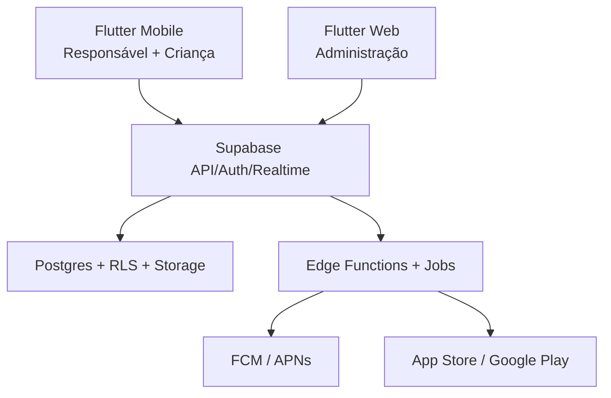

# 08 — Arquitetura Técnica

## 1. Visão



## 2. Repositório

Monorepo recomendado:

```text
apps/mobile
apps/admin_web
packages/domain
packages/data_access
packages/design_system
supabase/migrations
supabase/functions
supabase/tests
docs
```

O aplicativo móvel é um único produto e bundle por plataforma. O painel Web é uma superfície operacional separada.

## 3. Flutter móvel

### Organização por feature

```text
lib/
├── app/
├── core/
├── features/
│   ├── auth/
│   ├── family/
│   ├── children/
│   ├── tasks/
│   ├── approvals/
│   ├── wallet/
│   ├── rewards/
│   ├── progression/
│   ├── themes/
│   ├── subscriptions/
│   └── notifications/
└── l10n/
```

Camadas:

- apresentação: páginas, widgets e controladores;
- aplicação: casos de uso e coordenação;
- domínio: entidades e regras independentes;
- dados: Supabase, DTOs e repositórios.

### Recomendações

- Riverpod para estado e injeção;
- `go_router` para rotas com guards;
- modelos imutáveis;
- tema por tokens semânticos;
- strings em ARB desde o início, mesmo com apenas pt-BR;
- relógio, gerador de UUID e conectividade injetáveis para testes.

Versões devem ser escolhidas e travadas na implementação, sem copiar números desatualizados deste documento.

## 4. Supabase

### Auth

- responsáveis: e-mail/senha;
- administradores: conta separada, MFA obrigatório e função protegida;
- crianças: identidade anônima por aparelho + vínculo autorizado;
- sessão e refresh token armazenados de forma segura.

### Postgres

- fonte de verdade;
- RLS em todas as tabelas expostas;
- funções transacionais para saldo, aprovação e resgate;
- migrations versionadas no Git;
- testes de políticas por perfil.

### Storage

Buckets sugeridos:

- `theme-assets-public`: assets aprovados e públicos;
- `avatars-public`: avatares originais do produto;
- `family-media-private`: fotos opcionais da família, privadas;
- `support-private`: anexos futuros de suporte.

Fotos privadas usam autorização e URLs temporárias. Nome de arquivo não contém nome ou data de nascimento.

### Realtime

Usos:

- atualizar tarefas da criança após edição;
- mostrar aprovação quase imediata;
- atualizar KidsCoins/XP;
- atualizar pedidos de recompensa.

Toda assinatura Realtime respeita a mesma autorização dos dados.

### Edge Functions

Usos:

- convite por e-mail;
- autorizar aparelho infantil;
- operações que exigem segredo;
- envio de push;
- webhooks de assinatura;
- exclusão de família;
- tarefas agendadas;
- rotinas administrativas.

## 5. Login infantil seguro

Fluxo técnico recomendado:

1. Flutter inicia sessão anônima do Supabase no aparelho.
2. Função recebe código, perfil escolhido, PIN ou token de pareamento.
3. Função aplica rate limit e valida digest do código/PIN.
4. Cria vínculo `auth.uid() → child_id`.
5. RLS consulta vínculo ativo.
6. Revogação invalida vínculo e sessão.

Não criar e-mails infantis fictícios nem derivar senha a partir do PIN.

## 6. Operações atômicas

Devem ocorrer em função SQL transacional:

- concluir tarefa automática;
- aprovar tarefa;
- ajustar KidsCoins;
- aprovar/cancelar resgate;
- conceder XP e processar níveis;
- bônus de aniversário;
- validar limite do plano ao ativar agenda.

Cada operação:

- verifica autorização;
- bloqueia linhas necessárias;
- valida estado;
- registra ledger;
- atualiza cache de saldo;
- grava evento de outbox;
- retorna snapshot atualizado.

## 7. Outbox e notificações

Não enviar push no meio da transação principal. A transação grava `outbox_events`; um worker processa e marca:

- pendente;
- processando;
- enviado;
- falhou;
- descartado.

Retries usam backoff e idempotência.

## 8. Jobs

Jobs necessários:

- gerar ocorrências futuras;
- marcar atrasadas/expiradas;
- conceder aniversário;
- recalcular progresso diário;
- enviar lembretes;
- limpar convites/tokens expirados;
- processar exclusões aprovadas;
- sincronizar estados de assinatura.

Jobs precisam de lock distribuído ou chave única para não executar o mesmo efeito duas vezes.

## 9. Notificações

Firebase Cloud Messaging atende Android e iOS; no iOS, FCM encaminha por APNs.

- guardar tokens por aparelho e contexto;
- remover tokens inválidos;
- nenhum segredo do Firebase no cliente além das configurações públicas necessárias;
- credenciais de envio somente no backend;
- payload mínimo e sem dados pessoais sensíveis.

## 10. Assinaturas

- Flutter usa uma abstração sobre compras das lojas.
- Implementação recomendada: plugin oficial `in_app_purchase`.
- Backend valida recibos/estados e mantém entitlement.
- App Store e Google Play são fontes de preço.
- Notificações de servidor atualizam renovação, carência, cancelamento e expiração.
- A UI nunca libera Premium apenas porque recebeu callback local de compra.

## 11. Funcionamento online

O MVP não aceita mutações offline.

- detectar ausência de conexão;
- mostrar dados recentes apenas como cache de leitura, identificados como possivelmente desatualizados;
- bloquear conclusão, aprovação e resgate até reconectar;
- não manter fila silenciosa;
- revalidar a sessão depois de longas interrupções.

Dados de autenticação e preferências visuais podem permanecer localmente. Dados críticos continuam tendo o servidor como autoridade.

## 12. Ambientes

Obrigatórios:

- desenvolvimento;
- homologação;
- produção.

Cada ambiente possui:

- projeto Supabase próprio;
- Firebase próprio;
- IDs de produtos de loja próprios;
- chaves e URLs próprias;
- banco e buckets separados.

O repositório contém `.env.example`, nunca credenciais reais.

## 13. Observabilidade

Priorizar:

- logs estruturados no backend;
- métricas agregadas;
- trilha de auditoria;
- alertas de falhas de jobs, push e webhooks;
- correlação por request ID;
- nenhuma captura desnecessária de conteúdo infantil.

SDK de analytics ou crash de terceiro só pode entrar após análise de privacidade e consentimento. O MVP não usa SDK de anúncios.

## 14. CI/CD

Pipeline mínimo:

1. formatação;
2. análise estática;
3. testes Dart/Flutter;
4. testes SQL/RLS;
5. lint de migrations;
6. build Android, iOS e Web;
7. verificação de segredos;
8. deploy de homologação;
9. promoção controlada para produção.

## 15. Aproveitamento do Battle Runners

Pode reaproveitar conceitos e código comprovadamente desacoplado de:

- ledger;
- XP e níveis;
- animações de conquista;
- design de avatar;
- notificações;
- estrutura de migrations.

Antes de copiar:

- remover dependências do domínio de corrida;
- revisar RLS;
- conferir licenças de assets;
- criar testes específicos;
- não compartilhar banco de produção entre projetos.

