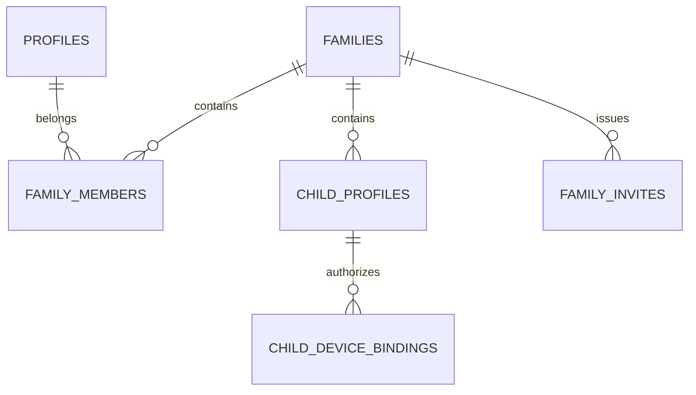
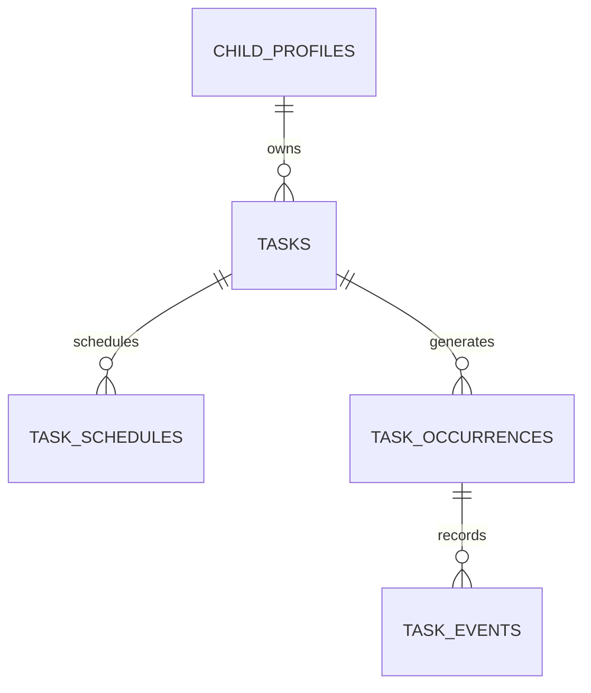
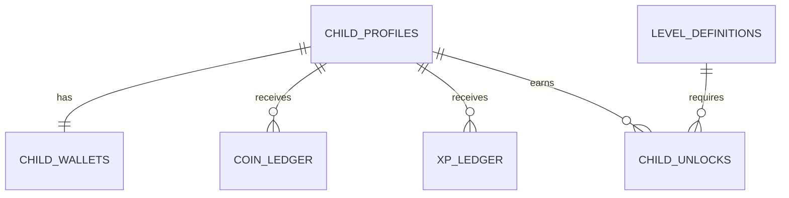

# 09 — Modelo de Dados

## 1. Convenções

- IDs: UUID.
- Timestamps: `timestamptz` em UTC.
- Datas da rotina: `date` no fuso da família.
- Valores monetários simbólicos: centavos inteiros.
- KidsCoins/XP: inteiros.
- Soft delete: `archived_at` para definições com histórico.
- Auditoria: `created_at`, `updated_at`, `created_by` quando aplicável.
- Identificadores técnicos em inglês; textos da UI em pt-BR.

## 2. Núcleo familiar

### `profiles`

| Campo | Tipo | Regra |
|---|---|---|
| `id` | uuid | FK para `auth.users`, PK |
| `display_name` | text | obrigatório |
| `locale` | text | padrão `pt-BR` |
| `status` | enum | active, blocked, deleted |
| `created_at` | timestamptz | servidor |

### `families`

| Campo | Tipo | Regra |
|---|---|---|
| `id` | uuid | PK |
| `name` | text | obrigatório |
| `timezone` | text | padrão `America/Sao_Paulo` |
| `family_code_digest` | text | único, código não armazenado em claro |
| `guardian_theme` | enum | blue, pink |
| `plan_id` | uuid | plano efetivo |
| `created_at` | timestamptz | servidor |
| `deletion_scheduled_at` | timestamptz | opcional |

### `family_members`

| Campo | Tipo | Regra |
|---|---|---|
| `family_id` | uuid | FK |
| `profile_id` | uuid | FK |
| `role` | enum | owner, guardian |
| `status` | enum | active, removed |
| `joined_at` | timestamptz | servidor |

Restrição única em `(family_id, profile_id)` para vínculo ativo.

### `family_invites`

- `family_id`
- `email_normalized`
- `token_digest`
- `role`
- `expires_at`
- `accepted_at`
- `cancelled_at`
- `invited_by`

### `child_profiles`

| Campo | Tipo | Regra |
|---|---|---|
| `id` | uuid | PK |
| `family_id` | uuid | FK |
| `first_name` | text | obrigatório |
| `nickname` | text | opcional |
| `birth_date` | date | obrigatório |
| `avatar_id` | uuid | padrão |
| `private_photo_path` | text | opcional |
| `pin_hash` | text | opcional |
| `pin_enabled` | boolean | padrão false |
| `theme_id` | uuid | FK |
| `age_mode` | enum | young, middle, teen |
| `streak_rule` | enum | at_least_one, all_required, percentage |
| `streak_percentage` | smallint | 1–100 |
| `level_bonus_coins` | integer | padrão 5 |
| `birthday_bonus_coins` | integer | padrão 50 |
| `status` | enum | active, plan_paused, archived |

Não existe campo de gênero.

### `child_device_bindings`

- `id`
- `child_id`
- `auth_user_id` da sessão técnica;
- `device_name`
- `authorized_by`
- `authorized_at`
- `last_seen_at`
- `revoked_at`

Restrição: uma identidade técnica ativa não pode apontar para várias famílias.

## 3. Tarefas

### `tasks`

- `id`
- `family_id`
- `child_id`
- `title`
- `description`
- `icon_key`
- `category`
- `period`
- `is_bonus`
- `is_required`
- `coin_reward`
- `xp_reward_default`
- `approval_mode`
- `late_policy`
- `sort_order`
- `is_active`
- `archived_at`
- `created_by`

### `task_schedules`

- `id`
- `task_id`
- `schedule_type`: once, recurring;
- `one_time_date`;
- `weekdays` como array validado;
- `starts_on`;
- `ends_on`;
- `start_time`;
- `due_time`;
- `timezone`;
- `active`.

### `task_occurrences`

| Campo | Finalidade |
|---|---|
| `id` | identidade da ocorrência |
| `task_id`, `child_id`, `family_id` | vínculos |
| `occurrence_date` | data local |
| `starts_at`, `due_at` | timestamps calculados |
| `status` | estado atual |
| `coin_reward_snapshot` | valor histórico |
| `xp_reward_snapshot` | valor histórico |
| `approval_mode_snapshot` | regra histórica |
| `late_policy_snapshot` | regra histórica |
| `title_snapshot`, `icon_snapshot` | histórico legível |
| `submitted_at`, `approved_at`, `expired_at` | eventos principais |
| `approved_by`, `rejection_reason` | revisão |
| `version` | concorrência otimista |

Índice único recomendado em `(task_id, child_id, occurrence_date)`.

### `task_events`

Log append-only:

- ocorrência;
- tipo;
- ator;
- perfil do ator;
- payload mínimo;
- idempotency key;
- timestamp.

## 4. Carteira e progressão

### `child_wallets`

- `child_id` PK;
- `coin_balance` com check `>= 0`;
- `total_xp` com check `>= 0`;
- `current_level`;
- `updated_at`;
- `version`.

É um cache transacional. Os ledgers são a trilha financeira real.

### `coin_ledger`

- `id`
- `family_id`
- `child_id`
- `entry_type`
- `amount_signed`
- `balance_after`
- `source_type`
- `source_id`
- `reason`
- `created_by`
- `created_at`
- `idempotency_key`

Restrições únicas impedem bônus ou aprovação duplicados.

### `xp_ledger`

Estrutura equivalente, sem débito normal:

- `amount`
- `total_after`
- `source_type`
- `source_id`
- `idempotency_key`.

### `level_definitions`

- `level`
- `min_total_xp`
- `default_coin_bonus`
- `title_key`
- `active`.

### `cosmetic_items`

- `id`
- `type`: avatar, frame, accessory, animation, theme_part, badge;
- `theme_id`;
- `required_level`;
- `required_plan`;
- `asset_key`;
- `active`.

### `child_unlocks`

Único em `(child_id, cosmetic_item_id)`.

### `daily_progress`

- `child_id`
- `progress_date`
- `required_total`
- `required_completed`
- `percentage`
- `qualifies_for_streak`
- `calculated_at`.

### `child_streaks`

- `child_id`
- `current_streak`
- `best_streak`
- `last_qualified_date`
- `updated_at`.

## 5. Recompensas

### `rewards`

- `id`
- `family_id`
- `child_id` opcional para recompensa compartilhada;
- `title`
- `description`
- `icon_key`
- `category`
- `cost_coins`
- `cash_equivalent_cents` opcional;
- `currency` padrão BRL;
- `active`
- `created_by`.

### `redemption_requests`

- `id`
- `family_id`
- `child_id`
- `reward_id`
- snapshots de título e custo;
- `status`;
- `requested_at`;
- `reviewed_at`;
- `reviewed_by`;
- `rejection_reason`;
- `delivered_at`;
- `idempotency_key`.

## 6. Temas e planos

### `themes`

- `id`
- `slug` único;
- `name`
- `plan_tier`;
- `manifest_json`;
- `version`;
- `status`: draft, published, retired;
- `published_at`.

### `theme_assets`

- tema;
- chave semântica;
- caminho;
- hash;
- tamanho;
- plataforma/densidade.

### `plans`

- `id`
- `code`: free, premium;
- `max_active_children`;
- `max_daily_occurrences`;
- `entitlements_json`;
- `active`.

### `subscriptions`

- `family_id`
- `store`
- `product_id`
- `original_transaction_id` ou equivalente;
- `status`;
- `current_period_end`;
- `grace_period_end`;
- `auto_renew`;
- `last_verified_at`.

### `subscription_events`

Append-only com identificador único do evento da loja.

## 7. Notificações e aparelhos

### `device_tokens`

- `auth_user_id`
- `child_binding_id` opcional;
- `platform`;
- `fcm_token` protegido;
- `locale`;
- `active`;
- `last_seen_at`.

### `notification_preferences`

- destinatário;
- tipo de evento;
- habilitado;
- minutos de antecedência;
- quiet hours.

### `notifications`

- destinatário;
- template;
- payload interno mínimo;
- estado de entrega;
- provider message ID;
- timestamps.

### `outbox_events`

- tipo;
- agregado;
- payload;
- idempotency key;
- attempts;
- next_attempt_at;
- processed_at.

## 8. Administração, privacidade e suporte

### `platform_admins`

- `profile_id`
- `role`: super_admin, support, content, billing;
- `mfa_required`;
- `active`.

### `audit_logs`

- ator;
- papel;
- ação;
- recurso;
- resultado;
- request ID;
- IP truncado/hasheado conforme política;
- timestamp.

### `deletion_requests`

- família;
- solicitante;
- estado;
- aprovação necessária;
- resposta do segundo responsável;
- rejeição;
- data programada;
- conclusão.

### `consent_records`

- responsável;
- criança/família;
- documento e versão;
- finalidade;
- estado;
- timestamp;
- revogação.

### `support_tickets`

Somente dados mínimos, com acesso restrito e retenção definida.

## 9. Matriz RLS resumida

| Recurso | Responsável da família | Criança vinculada | Admin da plataforma |
|---|---|---|---|
| Família | leitura/edição permitida | mínimo necessário | conforme papel |
| Outras famílias | nenhum acesso | nenhum acesso | acesso restrito/auditado |
| Crianças da família | administrar | somente o próprio perfil | restrito |
| Tarefas | administrar | ler próprias e concluir por função segura | suporte sem escrita por padrão |
| Ledgers | ler/ajuste por função | ler próprios | financeiro/auditoria |
| Recompensas | administrar | ler e solicitar | suporte restrito |
| Assinatura | ler/comprar | nenhum acesso | billing |
| Temas publicados | ler | ler autorizados | content administra |
| PIN/digest | nunca selecionar | nunca selecionar | nunca exibir |

## 10. Views e funções

Views recomendadas:

- `v_child_today_tasks`;
- `v_child_wallet_summary`;
- `v_guardian_dashboard`;
- `v_weekly_progress`;
- `v_pending_approvals`;
- `v_effective_entitlements`.

As views devem respeitar RLS ou ser expostas por funções seguras. Não usar `security definer` sem `search_path` fixo, checagem explícita de autorização e privilégios mínimos.

