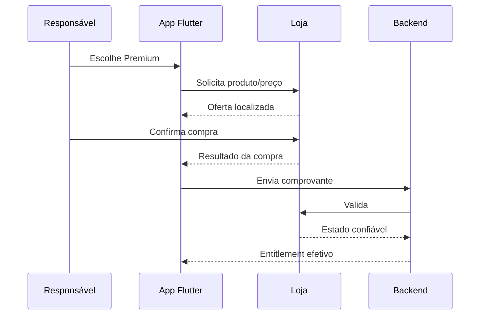

# 13 — Assinaturas e Entitlements

## 1. Modelo

- Plano `free`.
- Plano `premium` recorrente.
- Preço e periodicidade a definir durante o MVP.
- Entitlement aplicado no nível da família.
- Compra realizada apenas por responsável e por meio das lojas.
- Sem anúncios em ambos os planos.

## 2. Produtos

IDs são configuráveis por ambiente:

```text
kids_task_premium_monthly
kids_task_premium_yearly   # opcional, se aprovado depois
```

Não usar o ID como fonte única da regra. Manter mapeamento versionado entre produto, loja e entitlement.

## 3. Fluxo de compra



O callback local não é suficiente para liberar Premium de forma permanente.

## 4. Estados

| Estado | Acesso |
|---|---|
| `free` | limites gratuitos |
| `trialing` | Premium até término |
| `active` | Premium |
| `grace_period` | Premium durante carência da loja |
| `billing_retry` | conforme carência/estado confiável |
| `cancelled_active_until_end` | Premium até fim pago |
| `expired` | downgrade seguro |
| `revoked` | remover Premium após validação |
| `support_override` | Premium temporário e auditado |

## 5. Fonte de verdade

- A loja informa a transação.
- O backend valida e calcula entitlement.
- O banco armazena snapshot verificável.
- O aplicativo consulta `v_effective_entitlements`.
- O painel Web nunca substitui silenciosamente o histórico da loja.

## 6. Webhooks/notificações de servidor

Processar:

- compra;
- renovação;
- cancelamento;
- expiração;
- reembolso/revogação;
- mudança de produto;
- período de carência;
- recuperação de cobrança.

Cada evento:

- tem identificador único;
- é persistido antes do processamento;
- pode ser reprocessado;
- atualiza assinatura em transação;
- registra auditoria;
- gera notificação quando relevante.

## 7. Restaurar compras

- disponível na área do responsável;
- consulta a loja;
- envia comprovantes ao backend;
- reconstitui entitlement;
- não duplica assinatura;
- mostra resultado claro.

## 8. Downgrade

Aplicar as regras de `02_ESCOPO_MVP_E_PLANOS.md`:

- preservar dados;
- uma criança ativa;
- três ocorrências por dia;
- pausar excedentes;
- trocar tema Premium por gratuito;
- manter histórico, saldos e pendências.

## 9. Falhas

- loja indisponível: manter plano efetivo até próxima verificação dentro de janela segura;
- comprovante inválido: não liberar;
- webhook fora de ordem: comparar versão/data da loja;
- evento duplicado: idempotência;
- preço não carregou: ocultar botão de compra e mostrar tentar novamente;
- backend indisponível após compra: registrar estado local pendente e revalidar sem conceder entitlement definitivo.

## 10. Segurança

- credenciais de validação somente no backend;
- não logar recibo completo;
- vincular compra à família do responsável autenticado;
- impedir que criança acesse fluxo;
- verificar ambiente sandbox/produção;
- rate limit;
- alertar inconsistências.

## 11. Regras das lojas

Premium desbloqueia funcionalidades e conteúdo digital dentro do aplicativo. A implementação deve usar os sistemas de compra aplicáveis da App Store e Google Play, apresentar termos/preço com clareza e oferecer restauração.

As políticas mudam. Conferir as referências oficiais na preparação de cada release.

